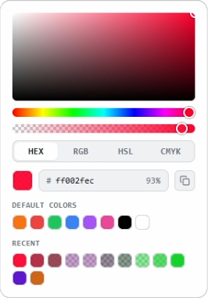
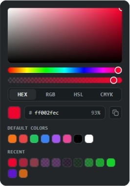

# react-piqua-color

**[▶ Try the live demo](https://altervayne.github.io/react-piqua-color/)**

A portable, fully controlled React color picker. It renders an SV (saturation/value)
square, a hue bar, segmented mode tabs, and labelled channel sliders for
**hex / rgb / hsl / cmyk**. All the color math and the sticky-hue behaviour that keeps
hue stable through degenerate colors (black, white, gray) are baked in.

Styling is fully self-contained via a single stylesheet driven by CSS custom
properties, **no Tailwind, no CSS framework required**. Drop it into any React app.

<p align="center">
  
  
</p>

## Features

- SV (saturation/value) square, hue bar, and an optional opacity bar
- `hex` / `rgb` / `hsl` / `cmyk` modes, with a sticky hue that survives black,
  white, and gray
- Opt-in alpha: 8-digit hex plus an opacity slider
- "Default colors" and "recents" rows, placeable above or below the picker; the
  swatch matching the current color is shown selected
- Eyedropper (where the browser supports it) and copy-to-clipboard
- Fully keyboard operable and screen-reader labelled
- CSS custom-property theming, a ready-made dark preset, and per-part class hooks
- Fully controlled, zero runtime dependencies, TypeScript types included

## Install

```bash
npm install react-piqua-color
```

`react` and `react-dom` (>=18) are peer dependencies.

## Usage

```tsx
import { useState } from 'react'
import { ColorPicker } from 'react-piqua-color'
import 'react-piqua-color/style.css'

const DEFAULT_SWATCHES = ['#f97316', '#ef4444', '#22c55e', '#3b82f6', '#a855f7', '#000000', '#ffffff']

function Example() {
   const [color, setColor] = useState('#f97316')

   // The consumer owns recents storage. The picker never stores, caps, or dedupes.
   const [recents, setRecents] = useState<string[]>([])

   return (
      <ColorPicker
         value={color}
         onChange={setColor}                 // live: fires during slider drag / hex typing
         swatches={DEFAULT_SWATCHES}
         recentColors={recents}
         onColorCommitted={committedColor => {
            // discrete commit: swatch click, hex completed, slider pointer-up.
            setRecents(previous => [committedColor, ...previous.filter(existing => existing !== committedColor)].slice(0, 12))
         }}
      />
   )
}
```

The component is **fully controlled**: it renders `value`, calls `onChange` on every
live edit, and never holds the "official" color itself. The `swatches` and
`recentColors` arrays are **display-only**: the picker renders a clickable square per
entry and calls `onChange` then `onColorCommitted` when one is clicked. It stores,
caps, dedupes, and persists **nothing**; that is entirely the consumer's job.
Whichever swatch or recent equals the current `value` is shown selected (matched
case-insensitively and shorthand-aware, respecting alpha when `alpha` is on).

## Props

| Prop               | Type                        | Required | Description                                                                                 |
| ------------------ | --------------------------- | -------- | ------------------------------------------------------------------------------------------- |
| `value`            | `string`                    | yes      | Current color as `#rrggbb`, or `#rrggbbaa` when `alpha` is on. Fully controlled.             |
| `onChange`         | `(hex: string) => void`     | yes      | Live change, fires continuously during slider drag and hex typing. Same width as `value`.    |
| `alpha`            | `boolean`                   | no       | Enable the opacity channel: adds an alpha slider and widens hex to 8 digits. Default `false`.|
| `onColorCommitted` | `(hex, source) => void`     | no       | Discrete commit; `source` says which interaction (see [Commit source](#commit-source)).      |
| `swatches`         | `string[]`                  | no       | "Default colors" row. Clickable display only; omit to hide the row.                         |
| `recentColors`     | `string[]`                  | no       | Recents row. Clickable display only; omit to hide the row.                                  |
| `swatchesLabel`    | `string`                    | no       | Label above the swatches row. Default `"Default colors"`.                                   |
| `recentLabel`      | `string`                    | no       | Label above the recents row. Default `"Recent"`.                                             |
| `swatchesPosition` | `'top' \| 'bottom'`         | no       | Place the swatches + recents block above or below the picker body. Default `'bottom'`.       |
| `className`        | `string`                    | no       | Appended to the root's class, alongside `pqc-root`.                                          |
| `style`            | `React.CSSProperties`       | no       | Merged onto the root's inline style, handy for setting `--pqc-*` tokens inline.              |
| `classNames`       | `ColorPickerClassNames`     | no       | Extra classes for individual parts (see [Part-level classes](#part-level-classes)).          |

## Commit source

`onColorCommitted` receives the source of the change as its second argument, so you
can react differently per interaction, for example closing a popover only when a
swatch is clicked:

```tsx
<ColorPicker
   value={color}
   onChange={setColor}
   onColorCommitted={(hex, source) => {
      addToRecents(hex)
      if (source === 'swatch') closePicker()
   }}
/>
```

`source` is one of:

| Value | Interaction |
| --- | --- |
| `'swatch'` | A click in the "Default colors" row |
| `'recent'` | A click in the recents row |
| `'input'` | A value typed into the hex field or a channel number box |
| `'slider'` | A drag or keypress on the SV square, hue / opacity bar, or a channel slider |
| `'eyedropper'` | A color picked with the screen eyedropper |

The `CommitSource` union type is exported for your handlers.

## Alpha / opacity

Off by default. Pass `alpha` to add an opacity slider below the hue bar and switch
the whole component to 8-digit hex:

```tsx
const [color, setColor] = useState('#f97316ff')

<ColorPicker alpha value={color} onChange={setColor} />
```

With `alpha` on, `value` and every callback are `#rrggbbaa` (a 6-digit `value` is
read as fully opaque). The slider reads and announces whole **percent** (0–100%),
while opacity is stored at full 8-bit precision, so an imported `#rrggbbaa`
round-trips losslessly. With `alpha` off, everything stays `#rrggbb` exactly as
before. Swatches may carry alpha too; the checkerboard shows through wherever a
color is translucent.

The hex field accepts 3- and 6-digit input (plus 4- and 8-digit when `alpha` is
on); shorthand like `f80` expands to `#ff8800` on blur. Output is always full
length.

Beside the hex field are a **copy** button and, where the browser supports the
[EyeDropper API](https://developer.mozilla.org/docs/Web/API/EyeDropper), an
**eyedropper** to pick a color from anywhere on screen. The eyedropper button is
feature-detected and simply absent where unsupported (e.g. Firefox).

## Accessibility

Every control is keyboard operable and labelled for assistive tech:

| Control | Keys |
| --- | --- |
| SV square | Arrow keys move saturation (←→) and brightness (↑↓); Shift for a ×10 step; Home / End set saturation to 0 / 100 |
| Hue bar, opacity bar, channel sliders | Arrows adjust by 1; Shift+Arrow / PageUp / PageDown by 10; Home / End jump to the ends |
| Mode tabs | Left / Right / Home / End move between `hex` / `rgb` / `hsl` / `cmyk` |

Sliders expose `role="slider"` with live `aria-valuetext` (percentages, degrees),
the tabs are a proper `role="tablist"`, and the swatch rows are labelled groups.
Focus rings appear for keyboard users only. Continuous edits fire `onChange`; the
discrete `onColorCommitted` fires once when a control is released or left (handy for
a recents list).

## Theming

Import the stylesheet once (`import 'react-piqua-color/style.css'`). Every knob is a
CSS custom property with a sensible **light-mode default**. Override any `--pqc-*`
token **on the picker itself** (via the `className`/`style` props) **or on any
ancestor**. Both inherit correctly.

### Dark mode

A ready-made dark theme ships as the opt-in `pqc-dark` class. Put it on the picker:

```tsx
<ColorPicker className="pqc-dark" value={color} onChange={setColor} />
```

or on any ancestor. To follow the OS preference, opt in through your own media query:

```css
@media (prefers-color-scheme: dark) {
   .my-panel .pqc-root { /* re-declare the pqc-dark tokens, or add the class in JS */ }
}
```

Fine-tune by overriding individual tokens after the class, e.g.
`style={{ ['--pqc-accent']: '#3b82f6' }}`.

### Overridable variables

| Variable            | Default            | Purpose                                          |
| ------------------- | ------------------ | ------------------------------------------------ |
| `--pqc-surface`     | `#ffffff`          | Raised surface: the active mode tab.             |
| `--pqc-bg`          | `#f1f2f4`          | Recessed background: tab strip, hex field.       |
| `--pqc-text`        | `#1a1d21`          | Primary text.                                    |
| `--pqc-muted`       | `#6b7280`          | Secondary / muted text.                          |
| `--pqc-border`      | `#d4d7dd`          | Hairline borders.                                |
| `--pqc-accent`      | `#f97316`          | Accent: focus rings.                             |
| `--pqc-thumb-ring`  | `#ffffff`          | Border color of the circular thumbs.             |
| `--pqc-font-mono`   | system mono stack  | Monospace font used for values and labels.       |
| `--pqc-font-size`   | `0.75rem`          | Base text size.                                  |
| `--pqc-radius`      | `0.5rem`           | Corner radius for larger surfaces.               |
| `--pqc-radius-sm`   | `0.375rem`         | Corner radius for small surfaces.                |
| `--pqc-gap`         | `0.625rem`         | Vertical gap between the picker's sections.      |
| `--pqc-sv-height`   | `120px`            | Height of the SV (saturation/value) square.      |
| `--pqc-hue-height`  | `0.75rem`          | Thickness of the hue bar.                        |
| `--pqc-track-height`| `0.5rem`           | Thickness of the channel slider tracks.          |
| `--pqc-thumb-size`  | `0.875rem`         | Diameter of the thumbs (the hue thumb is +2px).  |
| `--pqc-swatch-size` | `1.25rem`          | Size of the swatch / recent squares.             |
| `--pqc-focus-width` | `2px`              | Width of the keyboard focus rings.               |

Genuinely dynamic values (the SV/hue gradients, thumb positions, and per-channel
slider gradients) are computed and applied as inline styles, so they are not
themeable via CSS (they reflect the live color).

### Part-level classes

For structural tweaks beyond the tokens, `classNames` adds a class to an individual
part, alongside its built-in `pqc-*` class:

```tsx
<ColorPicker
   value={color}
   onChange={setColor}
   classNames={{ swatch: 'rounded-full', tabActive: 'my-active-tab' }}
/>
```

Keys: `svSquare`, `svThumb`, `hueBar`, `hueThumb`, `alphaBar`, `alphaThumb`,
`tabList`, `tab`, `tabActive` (added to the active tab, on top of `tab`), `slider`,
`sliderThumb`, `swatch`. The dynamic inline styles above still win over your class
for those specific properties (gradients, thumb positions).

## License

MIT
